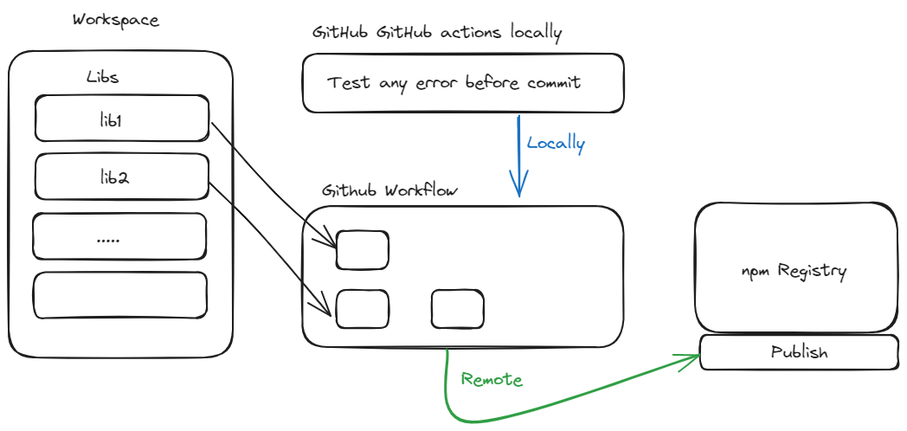

# Automated NPM Library Publishing Template 🚀

This branch serves as a template for automating the process of publishing libraries to NPM. You can add a new library and configure a dedicated GitHub workflow to handle its publishing seamlessly.

Additionally, you can run GitHub Actions locally using the gh act extension for easier testing and debugging.

## Features ✨

- Template for multiple libraries: Easily add and manage new libraries for automated publishing.
- GitHub Actions integration: Configure workflows for automatic builds and publishing.
- Local Action testing: Test and debug workflows on your local machine before pushing changes.



### Run GitHub Actions Locally 🚀

To run workflows locally, you need to install the gh act extension see [gh-act](https://github.com/nektos/gh-act).

After installation run:

```bash
gh act -j 'job-name' --pull=false
```

### Adding a New Library 🛠️

- **_Create the library_**: Add your library under the appropriate folder in the repository.
- **_Write a workflow_**: Define a GitHub workflow for the library, specifying its build and publishing steps.
- **_Test locally_**: Use gh act to ensure your workflow is correctly configured.
- **_Push to the repository_**: The workflow will automatically trigger on the appropriate events (e.g., pushes to main).

### How to Recreate This Workspace 🛠️

Follow these steps to set up a new workspace and libraries from scratch:

#### Step 1: Initialize a New Folder

Create a new folder for your workspace:

```bash
mkdir my-workspace
cd my-workspace
git init
```

#### Step 2: Create Angular Library

Run the following command to create an Angular workspace without a default application:

```bash
ng new my-workspace --no-create-application
cd my-workspace
ng generate library my-lib
```
